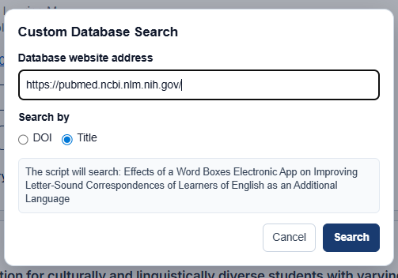

# Covidence PDF Finder

Covidence PDF Finder is designed to help researchers find PDF files for studies during the full-text review stage in Covidence. This tool is especially useful for systematic reviews, scoping reviews, meta-analyses, and other evidence synthesis projects where reviewers need to locate and upload full-text PDFs for many papers.

  

---

## Main Features

- Fills search boxes with DOI or title automatically on supported database pages.
- Searches direct open-access PDF sources first, including:
  - Unpaywall (a service that helps locate legal open-access versions of scholarly articles)
  - Europe PMC / PubMed Central
  - DOI landing pages
- If no open-access PDF is found, allows users to manually search additional sources, including Google Search, Google Scholar, OpenAlex, and ResearchGate.
- Includes a custom database search option allowing researchers search for PDFs using their institutional library resources (EBSCO, Ovid, APA PsycInfo, etc)

  

---

# Chrome Extension Installation

1. Click the green `<> Code` button on this GitHub page.
2. Click `Download ZIP`.
3. Unzip the downloaded ZIP file.
4. Only keep the `CovidencePDFinder` folder.
5. Open the `content.js` file.
6. Replace `YOUR_EMAIL@example.com` with your real email address. This is needed because Unpaywall asks API users to include a real email address.
7. Open Google Chrome.
8. Go to `chrome://extensions/`.
9. Turn on `Developer mode` in the top-right corner.
10. Click `Load unpacked`.
11. Select the `CovidencePDFinder` folder.
12. The extension should now be installed and ready to use.

## How to Use the Chrome Extension

1. Open a Covidence full-text review page.
2. Go to a study that needs a full-text PDF.
3. Use the added **Find + Download PDF** button to search for an open-access PDF.
4. Use **Search Options** if you want to manually search Google Scholar, ResearchGate, OpenAlex, DOI pages, or a custom database.
5. If using **Custom Search**, enter the database website and choose whether to search by DOI or title.

